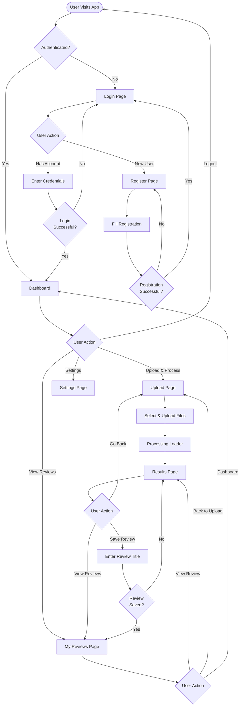
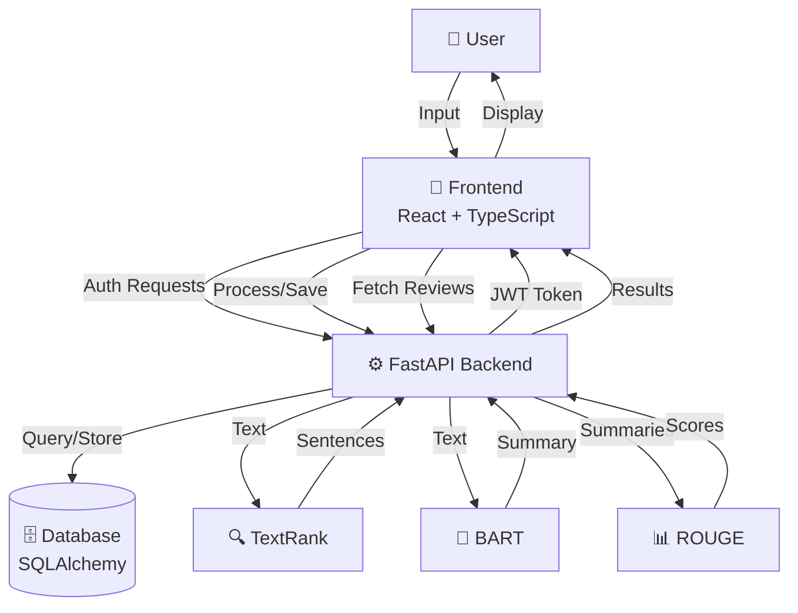
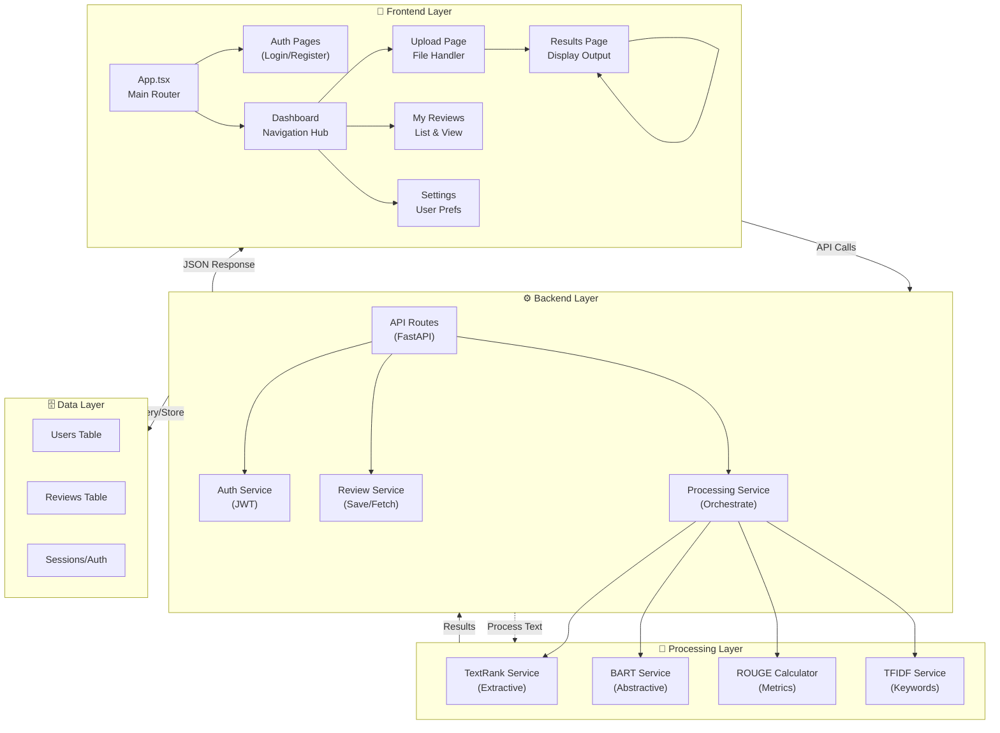
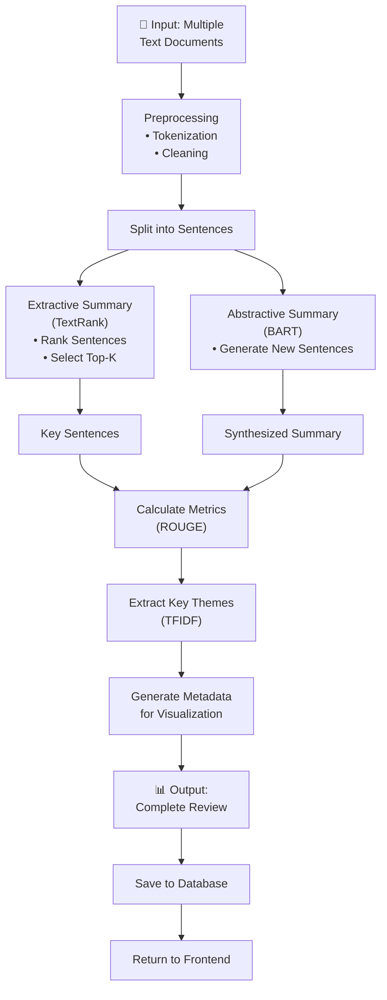

# LitReview AI - System Flowcharts

This document contains comprehensive flowcharts describing the LitReview AI system from multiple perspectives.

---

## 1. User Flow Diagram
**Overview:** Shows the complete user journey through the application, from login to saving reviews.

**Key Points:**
- User must authenticate before accessing any app features
- Main hub is the Dashboard with three primary actions
- Upload flow: File upload → Processing → Results → Save review
- Reviews can be viewed from multiple entry points
- Logout returns user to login state

---

## 2. Data Flow Diagram
**Overview:** Illustrates how data moves between the frontend, backend, database, and processing services.

**Key API Endpoints:**
- **Authentication:** `POST /register` • `POST /login` • `GET /users/me` • `POST /logout`
- **Processing:** `POST /reviews/process`
- **Management:** `POST /reviews/save` • `GET /reviews` • `GET /reviews/{id}`

**Processing Services:**
- **TextRank:** Extracts key sentences (extractive summarization)
- **BART:** Generates new summaries (abstractive summarization)  
- **ROUGE:** Calculates quality metrics and scores

**Key Endpoints:**
- **Authentication:** `POST /register`, `POST /login`, `GET /users/me`, `POST /logout`
- **Reviews:** `POST /reviews/process`, `POST /reviews/save`, `GET /reviews`, `GET /reviews/{id}`

**Processing Pipeline:**
- TextRank → Extracts key sentences from documents
- BART → Generates abstractive summaries
- ROUGE → Calculates quality metrics

---

## 3. Full Architecture Diagram
**Overview:** Comprehensive view of all system layers, components, and their relationships.

**Component Breakdown:**

### Frontend Layer (React + TypeScript)
- **App.tsx:** Main router managing page navigation
- **Auth Pages:** Login and registration pages
- **Dashboard:** Central hub with navigation to all features
- **Upload Page:** File selection and upload handler
- **Results Page:** Display processing results and summaries
- **My Reviews:** View and manage saved reviews
- **Settings:** User preferences and account info

### Backend Layer (FastAPI)
- **API Routes:** HTTP endpoint handlers
- **Auth Service:** JWT token management and user authentication
- **Review Service:** Database operations for reviews (save, retrieve)
- **Processing Service:** Orchestrates document processing workflow

### Processing Layer
- **TextRank Service:** Extracts key sentences (extractive summarization)
- **BART Service:** Generates abstractive summaries
- **ROUGE Calculator:** Computes quality metrics
- **TFIDF Service:** Identifies key themes and topics

### Database Layer (SQLAlchemy)
- **Users Table:** User accounts and credentials
- **Reviews Table:** Saved reviews with metadata
- **Sessions/Auth:** Authentication tokens and sessions

---

## 4. Processing Pipeline
**Overview:** Step-by-step workflow for processing input documents into complete reviews.

**Processing Steps:**

1. **Input:** Multiple academic abstracts/papers uploaded by user
2. **Preprocessing:** Text cleaning, tokenization, normalization
3. **Split:** Break documents into individual sentences for analysis
4. **Parallel Processing:**
   - **Extractive:** TextRank ranks and selects most important sentences
   - **Abstractive:** BART generates new, condensed sentences
5. **Metrics:** ROUGE scores evaluate quality of summaries
6. **Theme Extraction:** TFIDF identifies key concepts and themes
7. **Metadata Generation:** Create visualization data
8. **Output:** Complete review with all summaries, metrics, and themes
9. **Storage:** Save to database for future reference
10. **Display:** Return formatted data to frontend

---

## Architecture Summary

| Layer | Technology | Purpose |
|-------|-----------|---------|
| **Frontend** | React + TypeScript + Vite | User interface and navigation |
| **Backend** | FastAPI + SQLAlchemy | API endpoints and business logic |
| **Processing** | TextRank, BART, ROUGE, TFIDF | Document analysis and summarization |
| **Database** | SQLAlchemy + Alembic | Data persistence |
| **Authentication** | JWT | User session management |

---

## File References

- **Frontend:** [frontend/src/App.tsx](../frontend/src/App.tsx)
- **Backend:** [backend/src/main.py](../backend/src/main.py)
- **Routes:** [backend/src/api/routes.py](../backend/src/api/routes.py)
- **Services:** [backend/src/services/](../backend/src/services/)
- **Models:** [backend/src/models/](../backend/src/models/)

